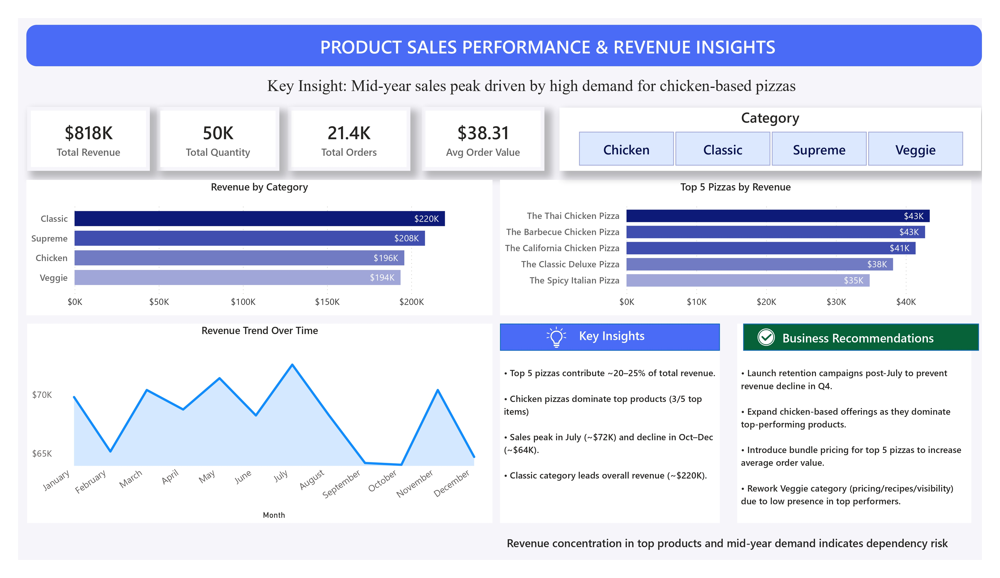

# 📊 Product Sales Performance & Revenue Insights  

A data-driven analysis of product sales to uncover revenue drivers, seasonal trends, and actionable business insights.

---

## 🔍 Problem Statement  
The business lacks visibility into product-level performance, seasonal sales trends, and key revenue drivers. This limits the ability to make data-driven decisions for improving profitability and optimizing product strategy.

---

## 🎯 Objective  
To support data-driven decision-making by identifying:
- Top-performing products and categories  
- Revenue trends over time  
- Key factors influencing sales performance  

---

## 🛠 Tools & Technologies  
- Python (Pandas, Data Analysis)  
- Power BI (Dashboard & Visualization)  
- Excel (Data Cleaning & Preprocessing)  

---

## ⚙️ Approach  
- Cleaned and prepared raw sales data using Excel and Python  
- Performed exploratory data analysis (EDA) to identify patterns and trends  
- Built an interactive Power BI dashboard to visualize KPIs and insights  

---

## 📈 Key Metrics  
- **Total Revenue:** $818K  
- **Total Orders:** 21.4K  
- **Total Quantity Sold:** 50K  
- **Average Order Value:** $38.31  

---

## 📊 Key Insights  
- Top 5 pizzas contribute ~20–25% of total revenue, indicating revenue concentration risk  
- Chicken-based pizzas dominate top-performing products (3 out of top 5)  
- Sales peak in July (~$72K) and decline significantly during Oct–Dec (~$64K)  
- Classic category generates the highest revenue (~$220K), followed by Supreme and Chicken  

---

## 💡 Business Impact  
- Heavy reliance on a small set of products increases revenue risk if demand shifts  
- Seasonal drop in Q4 highlights missed opportunities for retention strategies  
- Strong demand for chicken-based products indicates potential for expansion and upselling  

---

## 🚀 Recommendations  
- Introduce targeted promotions in Q4 to reduce seasonal revenue decline  
- Increase visibility and marketing of top-performing chicken pizzas to capitalize on high demand  
- Introduce combo offers on top-selling pizzas to drive higher average order value  
- Improve visibility, pricing, or recipes for underperforming categories like Veggie  

---

## 📷 Dashboard Preview  

---

## 📂 Data Source  
The dataset consists of product-level sales transactions, including category, revenue, quantity, and order details. The data was used to perform exploratory analysis and build an interactive dashboard for business insights.

---

## 📁 Project Structure  
├── data/ # Dataset (if included)
├── notebook/ # Python analysis files
├── dashboard.png # Dashboard image
├── README.md # Project documentation

---

## 📌 Conclusion  
This analysis identifies key revenue drivers, product performance trends, and potential business risks. The insights and recommendations can support strategic decisions to optimize product offerings, improve customer retention, and drive revenue growth.
